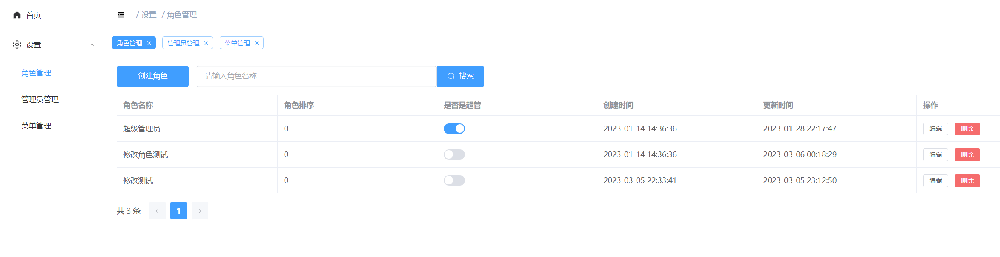
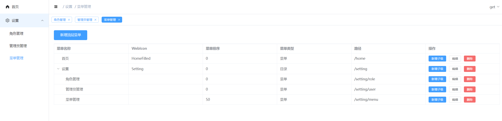

轻量级后台管理系统
----

### 技术栈

Gin
Vue3

### 运行

```shell
cd backend
go run main.go
```

```shell
cd frontend
npm run dev
```


### 项目介绍 

角色管理



菜单管理




### ref

https://www.bilibili.com/video/BV1Fj411u7zd