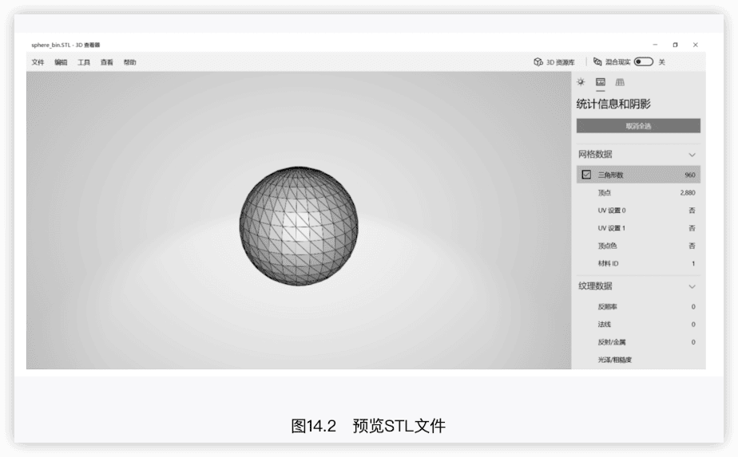
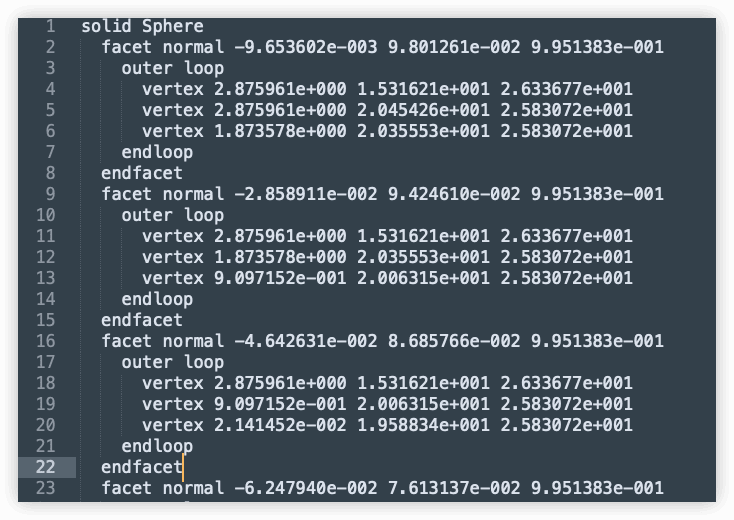
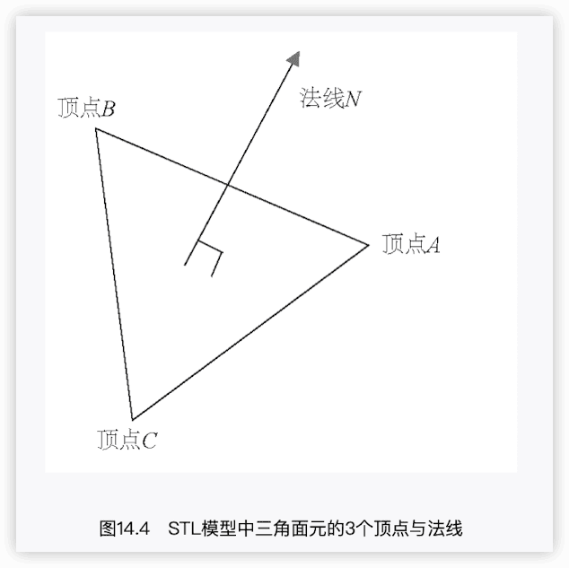
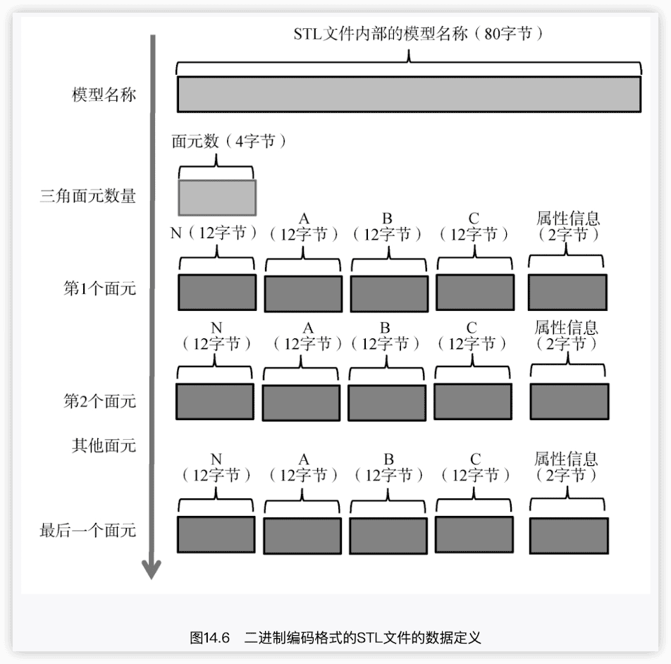

STL文件解析和MongoDB存储
-----

ch020_stl_mongodb  🔖

对3D打印领域中常见的二进制编码格式的STL文件进行读取，获取其三角面元信息，并将其解析为Go语言结构体和JSON文件的形式。
为了实现更好的程序性能和数据持久化，使用MongoDB进行数据存储，并编写相应的STL网格数据的写入和读取等操作代码，以及相应的单元测试和基准测试代码。

###  STL文件简介

STL文件是一种标准的3D文件，具有ASCII和二进制两种编码格式，`sphere_ascii.STL`和`sphere_bin.STL`。

sphere_ascii.STL文件用sublime打开：

第1行的solid Sphere表示这个模型的名称为Sphere。

第2行到第8行，定义了一个模型上的三角面元，或者称为**三角网格**（统称**三角面元**）。

#### 计算机图形学的相关知识

在计算机中看到的三维模型，比如游戏中的各种人物或建筑物的轮廓形状，往往是由三角形或四边形等多边形网格沿着模型表面拼接而成的。

例如，在图14.2中，可以看到一个个三角面元组成了球体的外表面，三角形的3个顶点可以被记为A、B和C，每个三角面元都具有法线方向，如图14.4所示。所谓==法线==，就是垂直于三角面元的矢量，法线方向决定了三角面元的正向与反向，就和我们人类互为正反的手心与手背一样。

上面的第2行到第8行定义的第1个三角面元的内容，第2行给出了这个三角面元的法线方向矢量，分别是法线矢量在三维空间中沿X轴、Y轴和Z轴的分量，即第1个三角面元的法线方向矢量为`＜-9.653602e-003，9.801261e-002，9.951383e-001＞`。

第4行到第6行，每一行依次定义了三角面元的3个顶点在X轴、Y轴和Z轴上的坐标。以第4行定义的顶点为例，这个顶点的X坐标、Y坐标和Z坐标分别为2.875961e+000、1.531621e+001和2.633677e+001。

> 相同模型的STL文件，sphere_ascii.STL文件的体积是sphere_bin.STL文件的5倍多。

### 项目功能需求设定

功能需求：基于Go语言标准库搭建HTTP服务器，将`assets/upload`文件夹作为保存用户已经上传完毕的二进制编码格式的STL文件的路径，同时为了进行项目演示，文件夹中已放入cube.STL、probe.STL和tube.STL这3个二进制编码格式的STL文件。在Go语言中，我们使用不同的“路由”来处理客户端的不同请求。

为简单起见，使用Postman模拟浏览器来发送请求，在服务器端构建3个路由地址来实现以下3个功能。

- 路由`/get-stl-list`用于获取assets/upload文件夹下的STL文件列表。
- 路由`save-stl-mongo`用于将某个特定STL文件解析为网格数据后，存储在MongoDB中作为一条document（即MongoDB中的一条记录）。如果发现已有该STL文件名所对应的document，则先删除该条document，再将STL文件的网格数据存储为一条document。
- 路由`query-stl-mongo`用于查询某个特定STL文件对应的三角面元信息，即MongoDB中的一条document。

### 二进制STL文件

在二进制编码格式的STL文件中：

- 最开始的80字节存储了STL文件内部的模型名称（与STL模型文件本身的文件名未必相同）；
- 其后的4字节存储了STL模型的三角面元数量；
- 接着以50字节为一组存储了每个三角面元的信息。
  - 其中，每组以12字节为一段，第1段12字节中存储了该三角面元的法线信息（由3个32位浮点数组成，每个32位浮点数为4字节，分别对应三角面元的三维法线矢量在X、Y、Z三个方向上的分量）。
  - 与法线类似，三角面元的3个顶点坐标信息占据了接下来的36字节（每个顶点信息由3个32位浮点数组成，每个32位浮点数为4字节，分别对应3个顶点坐标在三维空间中X、Y、Z三个方向上的分量），
  - 最后2字节存储了三角面元的属性信息（在一般情况下，我们可以不用理会这个属性信息）。

### ref 

[《Go语言从入门到项目实战》](https://book.douban.com/subject/36049170/)