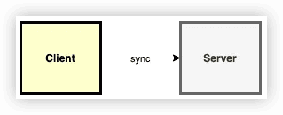
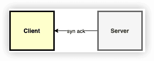
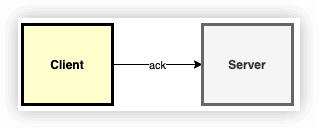

简单TCP端口扫描器
---
ch028_tcp_scan

TCP的握手有三个过程：
- 首先，客户端发送一个 syn 的包，表示建立回话的开始。如果客户端收到超时，说明端口可能在防火墙后面

- 第二，如果服务端应答 syn-ack 包，意味着这个端口是打开的，否则会返回 rst 包。

- 最后，客户端需要另外发送一个 ack 包。从这时起，连接就已经建立。

### ref

[Go实现简单TCP扫描器](https://mp.weixin.qq.com/s?__biz=Mzg5NDYxNTYyMw==&mid=2247487577&idx=1&sn=7b19903b390e17a406182f9fafa784fb&source=41#wechat_redirect)